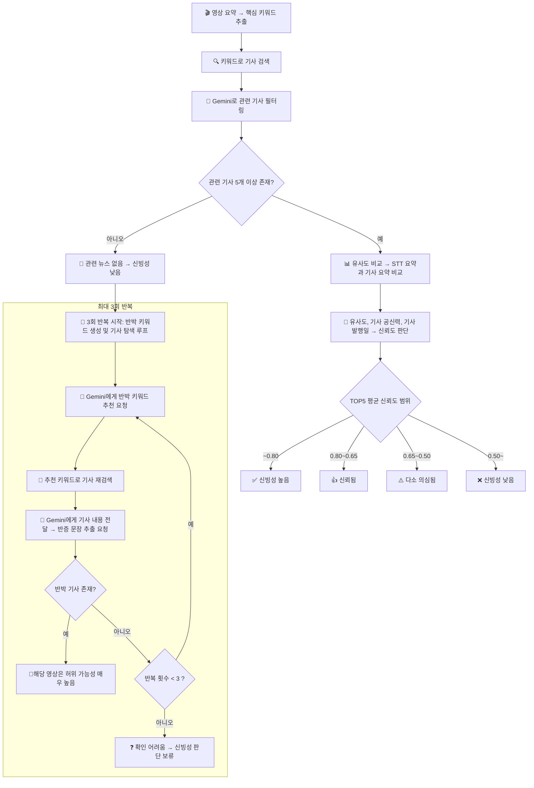

# YouTube Fake News Detector


## 📦 Introduce

생성형 AI를 활용해 유튜브 영상의 제목, STT요약을 기반으로 핵심 키워드를 추출하고 관련 뉴스 기사를 검색합니다. 영상과 기사 간의 코사인 유사도, 언론사 출처, 기사 발행일을 고려하여 신뢰도를 평가하는 **크롬 확장 프로그램 + Node.js 서버** 기반의 시스템입니다.

## ⚙️ Setup

+ [Node.js](https://nodejs.org/en) 설치
+ 패키지 설치
```bash
pip install -r requirements.txt
```
+ .env 파일 경로 설정   
   - 파일 경로는 절대 경로로 설정
   - [Google AI Studio](https://aistudio.google.com/prompts/new_chat) :: Gemini API 키 발급
   - [Naver Developers](https://developers.naver.com/main/) :: API ID/SECRET 코드 발급
``` dotenv
PYTHON_PATH=
YTDLP_PATH= 
GEMINI_API_KEY=   
NAVER_CLIENT_ID=
NAVER_CLIENT_SECRET=
```

## 🔎 How To Start
1. 크롬 기반 브라우저에서 확장 프로그램 등록
2. 터미널에서 임베딩 서버 코드가 있는 디렉토리로 접근 후 실행

```bash
cd node-server/src/python // 디렉토리 접근
python embedding_server.py // flask 서버 실행
```

3. 다른 터미널에서 node.js 서버 실행

```bash
cd node-server
npm start
```

4. 유튜브에서 신뢰도 확인 버튼으로 실행

## ✨ Key Features

- 유튜브 영상의 오디오를 STT로 변환
- Gemini API를 통한 요약 및 핵심 키워드 추출
- Naver 검색 API로 관련 뉴스 자동 수집
- 뉴스 요약과 영상 요약 간 유사도 계산
- 관련 기사 부족 시 반증 기사 검색 후 문장 제시
- 크롬 확장 프로그램에서 오버레이 형태로 신뢰도 표시

## 🛠️ Tech Stack

Frontend :: JavaScript, Chrome Extension API   
Backend :: Node.js, Express   
AI :: OpenAI Whisper, Google Gemini API    
Data Source :: YouTube, Naver News API

## 🧠 Algorithm



## 🧑🏻‍💻 Team AlGoBoNi

#### 이준형 
>PM, 백엔드 및 프론트엔드 개발 

#### 이상은
>백엔드 및 프론트엔드 개발   

#### 김현지
>디자인 및 프론트엔드 개발

#### 황해규
>백엔드 개발 및 AI 적용 및 구현   